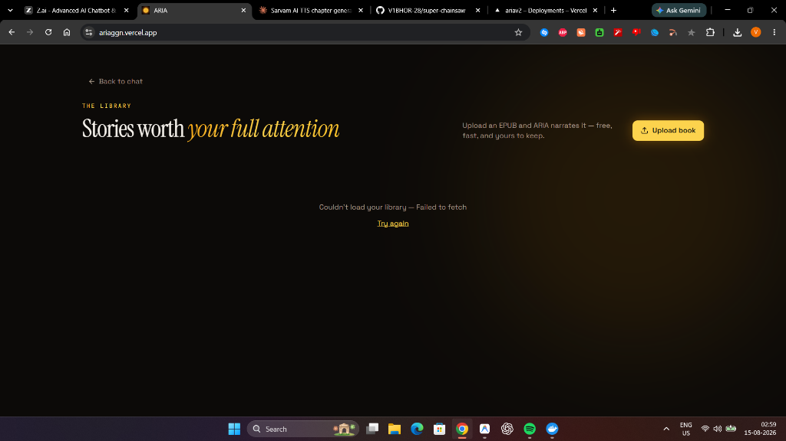

<div align="center">

# ✨ ARIA

### **Autonomous Reasoning Intelligent Assistant & Neural Audiobook Creator**

*An AI partner that reasons, reads, and thinks alongside you — paired with a local-first neural audiobook studio.*

[](https://ariaggn.vercel.app)
[](https://nextjs.org/)
[](https://react.dev/)
[](https://huggingface.co/hexgrad/Kokoro-82M)
[](https://neon.tech)
[](https://www.docker.com/)

<br />

<p align="center">
  
</p>

</div>

---

## 📖 Table of Contents

- [Overview](#-overview)
- [Key Features](#-key-features)
  - [1. Autonomous Reasoning Chat Partner](#1-autonomous-reasoning-chat-partner)
  - [2. Neural Audiobook Creator & Player](#2-neural-audiobook-creator--player)
  - [3. Reflowable EPUB & PDF Reader](#3-reflowable-epub--pdf-reader)
  - [4. Ambient BGM Soundscapes](#4-ambient-bgm-soundscapes)
  - [5. Offline & Local-First Caching](#5-offline--local-first-caching)
- [Visual Walkthrough](#-visual-walkthrough)
- [System Architecture](#-system-architecture)
- [Tech Stack](#-tech-stack)
- [Getting Started](#-getting-started)
  - [Prerequisites](#prerequisites)
  - [1. Clone and Install](#1-clone-and-install)
  - [2. Environment Configuration](#2-environment-configuration)
  - [3. Database Setup](#3-database-setup)
  - [4. Start Audiobook Backend (Docker)](#4-start-audiobook-backend-docker)
  - [5. Launch Web App](#5-launch-web-app)
- [Audiobook Engine & Voice Catalog](#-audiobook-engine--voice-catalog)
- [Environment Variables](#-environment-variables)
- [License](#-license)

---

## 🌟 Overview

**ARIA** blends two powerful workspaces into one unified, elegant experience:

1. **The Reasoning Companion**: An autonomous conversational intelligence powered by Sarvam 105B Reasoning, GPT-OSS, and Gemini Flash that remembers your personal context, forms opinions, challenges your thinking, and pulls facts from your custom knowledge library.
2. **The Neural Audiobook Studio**: A local-first audiobook synthesis suite that converts any EPUB or PDF into studio-grade audiobooks using the offline **Kokoro-82M neural TTS engine** with 10 curated human-grade voices, paired with ambient genre music loops and a reflowable book reader.

---

## 🚀 Key Features

### 1. Autonomous Reasoning Chat Partner
* **Dual-Field Reasoning Architecture**: Deep chain-of-thought processing via Sarvam 105B Reasoning with structured 4096-token budgets and GPT-OSS fallback.
* **Persistent Memory & Vector Search**: Automatic fact extraction stored with 768-dimensional embeddings (`pgvector`) on Neon PostgreSQL.
* **Knowledge Ingestion**: Upload PDFs, paste rich text, or ingest classic books directly from Archive.org into your semantic RAG library.
* **Live Inline Research**: Web search fallback using Tavily and Serper for real-time citations and factual grounding.
* **Mood & Daily Digest**: Built-in emotional state tracking and daily proactive check-ins.

### 2. Neural Audiobook Creator & Player
* **100% Free, Offline Neural Voice Engine**: Built-in **Kokoro-82M** PyTorch TTS engine (Grade A/B curated voices) with lazy-loaded pipeline and zero cloud audio API costs.
* **Intelligent Document Ingestion**:
  * **PDF Chapter Segmentation**: Heading pattern recognition (`Chapter X`, `Canto I`) with automatic running-header page merging.
  * **EPUB Spine Parser**: Full chapter, metadata, and embedded cover art extraction.
* **Per-Chapter Playlist Player**: Gapless audio playback, scrub bar, chapter duration tracking, and playback position persistence.
* **Batch or Selective Generation**: Convert entire books or select individual chapters on demand.

### 3. Reflowable EPUB & PDF Reader
* **Powered by `foliate-js`**: Modern CSS multi-column pagination that eliminates JavaScript measurement race conditions and page clipping.
* **Universal Document Support**: Dual parser with magic-byte detection (`%PDF-` vs `PK\x03\x04`) that renders both EPUBs and PDFs as clean, reflowable text paragraphs.
* **Reading Customization**: Font size scaling (60%–200%), light/dark theme toggle, TOC chapter drawer, and keyboard arrow navigation.

### 4. Ambient BGM Soundscapes
* **6 Ambient Genre Loops**: Pre-mastered, seamless background music loops designed to play quietly under narration:
  * 🌌 **Fantasy** — Warm, acoustic ambient memory
  * 🚀 **Sci-Fi** — Deep atmospheric synth drones
  * 🔍 **Mystery** — Suspenseful cinematic pads
  * 🌿 **Romance** — Gentle acoustic warmth
  * 🎻 **Classic** — Calm meditative classical strings
  * 🗺️ **Adventure** — Cinematic atmospheric groove
* **Synchronized Playback**: Automatically pauses when narration pauses, loops infinitely, and remembers volume settings in `localStorage`.

### 5. Offline & Local-First Caching
* **IndexedDB Chapter Audio Cache (`audio-cache.ts`)**: Chapter MP3 audio is cached locally as Blobs on first playback. When the backend or Docker is stopped, audiobooks continue playing seamlessly offline.
* **IndexedDB EPUB Cache (`epub-cache.ts`)**: Book text and structural files are saved in browser storage for instant, offline reading.

---

## 📸 Visual Walkthrough

<div align="center">

### 💬 Thinking Partner & Mood Tracking Workspace
*Chat, reflect, explore ideas, and log daily thoughts with persistent memory.*


<br />

### 📚 Audiobook Library & Multi-Chapter Studio
*Manage your collection, inspect chapter breakdowns, and generate neural audiobooks.*



</div>

---

## 🏗️ System Architecture

```text
┌─────────────────────────────────────────────────────────────────────────┐
│                           Client Browser                                 │
│  Next.js 16 App · Zustand State · IndexedDB Audio/EPUB Caches            │
│  foliate-js Reflowable Reader · Web Audio BGM Player Engine              │
└───────────────────┬─────────────────────────────────┬───────────────────┘
                    │                                 │
                    │ /api/*                          │ /api/abm/* (Proxy)
                    ▼                                 ▼
┌───────────────────────────────────────┐  ┌──────────────────────────────┐
│       Vercel Serverless (Node.js)     │  │  Audiobook Engine (Docker)   │
│  - NextAuth.js Authentication         │  │  - Kokoro-82M Neural TTS     │
│  - Streaming Chat & Reasoning API     │  │  - Edge-TTS Synthesizer      │
│  - Memory Auto-Detection & Retrieval  │  │  - PDF / EPUB Chapter Split  │
│  - Knowledge Ingestion & Chunking     │  │  - ffmpeg MP3 Transcoder     │
│  - Web Search Cascade (Tavily/Serper) │  │  - Local Data Volume Storage │
└───────────────────┬───────────────────┘  └──────────────┬───────────────┘
                    │                                     │
                    ▼                                     ▼
┌───────────────────────────────────────┐  ┌──────────────────────────────┐
│       Neon PostgreSQL + pgvector      │  │     ngrok Secure Tunnel      │
│  (Users, Memories, Conversations,     │  │  (Connects Vercel frontend   │
│   Knowledge Embeddings, Audiobooks)   │  │   to local Docker engine)    │
└───────────────────────────────────────┘  └──────────────────────────────┘
```

---

## 💻 Tech Stack

| Domain | Technologies |
| :--- | :--- |
| **Frontend Framework** | Next.js 16 (App Router), React 19, TypeScript 5 |
| **Styling & UI** | Tailwind CSS v4, Framer Motion, Radix UI Primitives, Lucide Icons |
| **State & Local Storage** | Zustand, IndexedDB (Blobs for MP3s & Books), LocalStorage |
| **Reader Engine** | foliate-js (CSS Multi-Column Pagination), PDF.js (Local Vendor Build) |
| **Reasoning & LLMs** | Sarvam 105B Reasoning, GPT-OSS, Google Gemini Flash, Groq |
| **Embeddings & Search** | Gemini `text-embedding-001` (768-dim), pgvector cosine similarity |
| **TTS & Audio Backend** | Python 3.11, Kokoro-82M (PyTorch CPU), Edge-TTS, ffmpeg, Flask |
| **Database & ORM** | PostgreSQL (Neon Serverless), Prisma ORM |
| **Container & Tunnel** | Docker Compose, ngrok tunnel (Audiobook Bridge) |

---

## 🛠️ Getting Started

### Prerequisites
- **Node.js 18+** and **npm** (or Bun)
- **Docker Desktop** (WSL2 backend on Windows or native Linux/macOS)
- **PostgreSQL Database** with `pgvector` (e.g. [Neon](https://neon.tech))

---

### 1. Clone and Install

```bash
git clone https://github.com/V1BHOR-28/super-chainsaw.git aria
cd aria
npm install
```

### 2. Environment Configuration

Copy the example environment file and configure your API keys:

```bash
cp .env.example .env
```

### 3. Database Setup

Synchronize the Prisma schema and pgvector indexes with your database:

```bash
npx prisma generate
npx prisma db push
```

### 4. Start Audiobook Backend (Docker)

Start the Kokoro neural TTS backend and ngrok tunnel:

```bash
docker compose up -d --build
```

*The backend healthcheck will confirm when Kokoro-82M and audio services are ready on port `5601`.*

### 5. Launch Web App

```bash
npm run dev
```

Open [http://localhost:3000](http://localhost:3000) in your browser.

---

## 🎙️ Audiobook Engine & Voice Catalog

ARIA includes 10 hand-curated Kokoro neural voices optimized for long-form literature:

| Voice ID | Voice Name | Gender | Accent | Character Style |
| :--- | :--- | :--- | :--- | :--- |
| `kokoro:af_heart` | **Heart** ⭐ | Female | American | Warm, expressive & natural (Grade A) |
| `kokoro:af_bella` | **Bella** | Female | American | Warm, conversational (Grade A-) |
| `kokoro:af_nicole` | **Nicole** | Female | American | Crisp, clear narrator (Grade B-) |
| `kokoro:bf_emma` | **Emma** | Female | British | Sophisticated, measured (Grade B-) |
| `kokoro:af_aoede` | **Aoede** | Female | American | Soft, melodic storytelling (Grade C+) |
| `kokoro:af_kore` | **Kore** | Female | American | Steady, grounded cadence (Grade C+) |
| `kokoro:af_sarah` | **Sarah** | Female | American | Calm, modern documentary (Grade C+) |
| `kokoro:bf_isabella` | **Isabella** | Female | British | Traditional literary reading (Grade C) |
| `kokoro:am_michael` | **Michael** ⭐ | Male | American | Deep, resonant & commanding (Grade C+) |
| `kokoro:am_fenrir` | **Fenrir** | Male | American | Low, dramatic baritone (Grade C+) |

*All voices synthesize locally with zero character limits or credit charges.*

---

## 🔐 Environment Variables

| Variable | Description |
| :--- | :--- |
| `DATABASE_URL` | PostgreSQL connection string (Neon with pgvector) |
| `NEXTAUTH_SECRET` | NextAuth JWT signing secret |
| `GOOGLE_CLIENT_ID` / `_SECRET` | Google OAuth credentials for one-click login |
| `SARVAM_API_KEY` | Sarvam AI API key for 105B deep reasoning |
| `OPENROUTER_API_KEY` | OpenRouter key for primary chat & LLM fallback |
| `GEMINI_API_KEY` | Google Gemini key for 768-dim embeddings & JSON parsing |
| `GROQ_API_KEY` | Groq high-speed Llama-3 inference |
| `TAVILY_API_KEY` / `SERPER_API_KEY`| Web search APIs for live source citations |
| `RESEND_API_KEY` | Transactional email provider for authentication |
| `ABM_SERVICE_URL` | URL of the audiobook backend (`http://localhost:5601` or ngrok URL) |

---

## 📄 License

Private Project. Built with ❤️ for readers, thinkers, and audiobook lovers.
