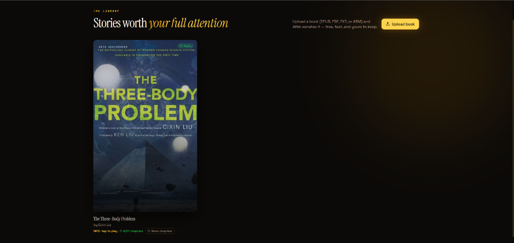
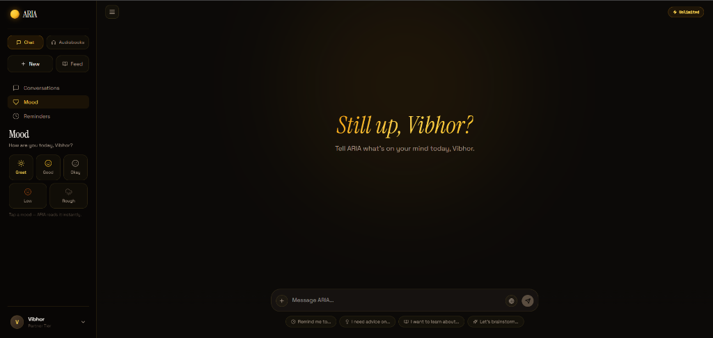

<div align="center">

# ✨ ARIA

### **Not a Chatbot. A Thinking Partner & Neural Audiobook Studio.**

*An autonomous reasoning companion that thinks alongside you — paired with a studio-grade neural audiobook creator.*

<br />

[](https://ariaggn.vercel.app)
[](https://huggingface.co/hexgrad/Kokoro-82M)
[](https://nextjs.org/)
[](https://neon.tech)
[](#offline--local-first-resilience)

<br />

<p align="center">
  
</p>

[**Launch ARIA**](https://ariaggn.vercel.app) • [**Explore Features**](#-core-product-pillars) • [**Voice Engine**](#-neural-voice-catalog) • [**Architecture**](#-system-architecture)

</div>

---

## 💡 The Vision

Most AI tools act like reactive search boxes. They wait, summarize, and forget.

**ARIA** is designed from first principles as an **intellectual partner**:
* **It reasons before responding**: Utilizing deep chain-of-thought models that examine nuances, debate assumptions, and push your thinking further.
* **It remembers you**: Building an evolving, vector-indexed memory graph of your projects, preferences, and ideas across conversations.
* **It reads with you**: Turning raw books, papers, and EPUB/PDF files into interactive knowledge and studio-quality narrated audiobooks with ambient soundscapes.

---

## 🏛️ Core Product Pillars

### 1. Autonomous Reasoning & Personal Thinking Partner

<div align="center">
  
</div>

* **Dual-Field Chain of Thought**: Powered by Sarvam 105B Reasoning with a dedicated 4,096-token reasoning budget and GPT-OSS fallback. You receive insightful, deeply deliberated conclusions without raw model clutter.
* **Persistent Vector Memory (`pgvector`)**: Facts, context, and insights about you are automatically identified, embedded (768-dim), and stored in Neon PostgreSQL. Relevant memories are recalled seamlessly during relevant discussions.
* **Library & Classic Book Ingestion**: Feed ARIA research papers, custom documents, or pull public-domain masterpieces straight from Archive.org into your personal semantic knowledge base.
* **Factual Web Research**: When conversations require real-time knowledge, ARIA searches the live web via Tavily and Serper, embedding inline source citations.
* **Proactive Daily Check-In**: A built-in mood and reflection layer that helps you log daily thoughts and track intellectual focus.

---

### 2. Neural Audiobook Creator

Convert any **EPUB** or **PDF** book into a fully produced, chapter-segmented audiobook with zero cloud token charges or character limits.

* **Kokoro-82M Neural Synthesis Engine**: Generates human-like, expressive speech locally with natural cadence, phrasing, and emotional depth.
* **Intelligent Document Ingestion**:
  * **Smart PDF Segmentation**: Detects chapter headers (`Chapter I`, `Canto II`) while automatically merging running page headers into cohesive chapters.
  * **EPUB Spine Parser**: Preserves table of contents structure, metadata, and embedded artwork.
* **Playlist Player**: Gapless chapter playback, seekable waveforms, duration previews, and persistent resume-where-you-left-off position.
* **Selective Batch Generation**: Choose specific chapters or convert whole volumes in the background.

---

### 3. Modern Reflowable Reader & Ambient Soundscapes

* **Reflowable CSS Pagination (`foliate-js`)**: Eliminates JavaScript layout race conditions and awkward page cuts. Books flow smoothly into beautiful multi-column pages on any screen size.
* **Universal Format Handling**: Magic-byte inspection accurately routes both EPUBs and PDFs into readable, selectable HTML paragraphs.
* **Typography Controls**: Instant font-size scaling (60% to 200%), light/dark reader modes, TOC navigation drawer, and keyboard arrow controls.
* **6 Curated Ambient Music Soundscapes**:
  * 🌌 **Fantasy** — Gentle acoustic warmth & nostalgic melody
  * 🚀 **Sci-Fi** — Deep atmospheric synth drones
  * 🔍 **Mystery** — Suspenseful cinematic pads
  * 🌿 **Romance** — Warm acoustic tranquility
  * 🎻 **Classic** — Meditative chamber strings
  * 🗺️ **Adventure** — Cinematic ambient groove
* **Adaptive Audio Sync**: Background music automatically syncs with narration, looping quietly and preserving custom volume levels.

---

### 4. Offline & Local-First Resilience

* **IndexedDB Chapter Audio Cache (`audio-cache.ts`)**: Chapter MP3 bytes are stored locally as Blobs upon first listen. You can continue listening to your entire book even completely offline.
* **IndexedDB EPUB Cache (`epub-cache.ts`)**: Extracted books and chapter manifests persist on your device for instant, zero-latency loading.

---

## 🎙️ Neural Voice Catalog

ARIA features 10 hand-curated Kokoro neural voices:

| Voice | Gender | Accent | Tone & Style | Best For |
| :--- | :--- | :--- | :--- | :--- |
| **Heart** ⭐ | Female | American | Warm, expressive & vibrant | Fiction, Memoirs, Narrative Literature |
| **Bella** | Female | American | Conversational, smooth & warm | General Non-Fiction, Biographies |
| **Nicole** | Female | American | Crisp, modern & articulate | Science, Tech, Business & Essays |
| **Emma** | Female | British | Sophisticated, poetic & clear | Classics, Philosophy, Poetry |
| **Aoede** | Female | American | Soft, melodic & intimate | Fantasy, Cozy Reads, Bedtime Listening |
| **Kore** | Female | American | Grounded, calm & steady | Historical Fiction, Long-Form Studies |
| **Sarah** | Female | American | Neutral, modern & balanced | Audiobooks, News, Deep Dives |
| **Isabella** | Female | British | Traditional, refined literary tone | Period Literature, Historical Works |
| **Michael** ⭐ | Male | American | Resonant, authoritative & deep | Thrillers, Sci-Fi, Action & Non-Fiction |
| **Fenrir** | Male | American | Low, dramatic & cinematic | Dark Fantasy, Mystery, Suspense |

---

## 🏗️ System Architecture

```text
┌──────────────────────────────────────────────────────────────────────────────┐
│                              Client Interface                                │
│  Next.js 16 App · Zustand Store · foliate-js Reader · IndexedDB Blob Cache   │
└──────────────────────┬───────────────────────────────┬───────────────────────┘
                       │                               │
                       │ REST / SSE                    │ /api/abm/* (Proxy)
                       ▼                               ▼
┌────────────────────────────────────────┐  ┌──────────────────────────────────┐
│      Vercel Serverless Edge Layer      │  │     Audiobook Engine Backend     │
│  - NextAuth.js User Sessions           │  │  - Kokoro-82M Neural TTS Model   │
│  - Reasoning Engine & LLM Orchestrator │  │  - PDF / EPUB Chapter Splitter   │
│  - Semantic Memory Retrieval           │  │  - ffmpeg MP3 Transcoder         │
│  - Knowledge Ingestion & Chunking      │  │  - Local Data Volume Storage     │
└──────────────────────┬─────────────────┘  └──────────────────┬───────────────┘
                       │                                       │
                       ▼                                       ▼
┌────────────────────────────────────────┐  ┌──────────────────────────────────┐
│       Neon PostgreSQL + pgvector       │  │       ngrok Secure Tunnel        │
│  (Users, Memories, Conversations,      │  │  (Connects edge application      │
│   Knowledge Embeddings, Audiobooks)    │  │   to local neural engine)        │
└────────────────────────────────────────┘  └──────────────────────────────────┘
```

---

## 🛡️ Privacy & Security

* **Local-First Processing**: Book files and synthesized audio are cached securely in your browser storage.
* **Isolated Audio Processing**: Audio synthesis runs inside isolated containerized workers.
* **Encrypted Authentication**: Secure NextAuth session tokens and bcrypt password hashing.

---

## 🌐 Experience ARIA

The production deployment of ARIA is live at:

👉 [**https://ariaggn.vercel.app**](https://ariaggn.vercel.app)

---

<div align="center">
  <sub>Built with ❤️ for readers, thinkers, and audiobook lovers everywhere.</sub>
</div>
